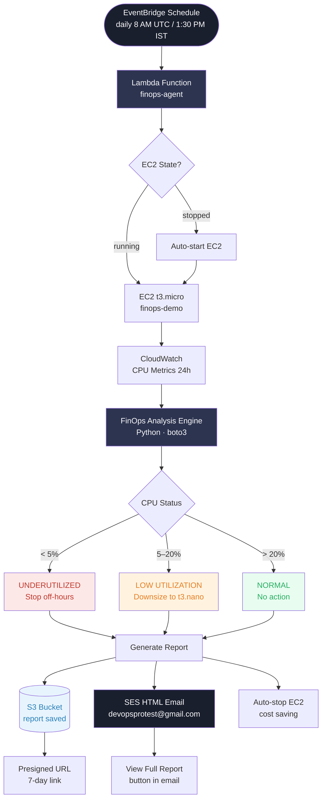
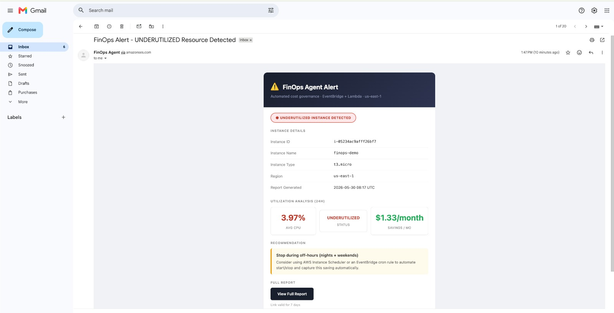
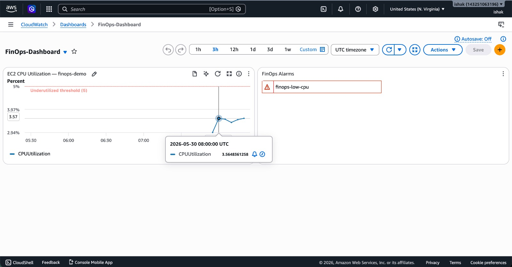

# FinOps Agent – Automated AWS Cost Optimization

> Terraform-managed AWS infrastructure with a fully automated Python agent that detects underutilized EC2 instances, generates cost optimization reports, saves them to S3, and sends professional HTML email alerts — triggered daily by EventBridge + Lambda with zero manual intervention.

---

## Architecture



---

## Demo Screenshots

### HTML Email Alert


### CloudWatch Dashboard


---

## AWS Resources (all via Terraform)

| Resource | Name | Purpose |
|----------|------|---------|
| EC2 Instance | `finops-demo` | t3.micro — monitored workload |
| IAM Role (EC2) | `finops-ec2-role` | CloudWatch + SNS access |
| IAM Role (Lambda) | `finops-lambda-role` | EC2 + CW + SNS + S3 + SES |
| Security Group | `finops-sg` | SSH access |
| SNS Topic | `finops-alerts` | Backup plain-text alerts |
| SES Identity | `devopsprotest@gmail.com` | HTML email sender |
| S3 Bucket | `finops-reports-*` | Report storage |
| Lambda Function | `finops-agent` | Core automation logic |
| EventBridge Rule | `finops-daily-trigger` | Daily 8 AM UTC schedule |
| CloudWatch Alarm | `finops-low-cpu` | Triggers at CPU < 5% |
| CloudWatch Dashboard | `FinOps-Dashboard` | CPU graph + alarm widget |

---

## FinOps Agent Workflow

```
Step 1: Resolve EC2 instance by tag (Name=finops-demo)
Step 2: Auto-start EC2 if stopped
Step 3: Fetch CloudWatch CPU metrics (24h average)
Step 4: Apply utilization rules
        CPU < 5%  → UNDERUTILIZED  → Stop during off-hours
        CPU < 20% → LOW UTILIZATION → Downsize to t3.nano
        CPU > 20% → NORMAL         → No action needed
Step 5: Generate Markdown cost optimization report
Step 6: Save report to S3 + generate 7-day presigned URL
Step 7: Send HTML email alert via SES (with View Report button)
Step 8: Auto-stop EC2 (if Lambda started it)
```

---

## Project Structure

```
finOps-agent/
├── terraform/
│   ├── main.tf          # EC2, IAM, SG, CloudWatch, SNS
│   ├── lambda.tf        # Lambda, S3, EventBridge, SES
│   ├── variables.tf
│   ├── outputs.tf
│   └── terraform.tfvars # region + email (git-ignored)
├── lambda/
│   └── finops_lambda.py # Automated Lambda handler
├── agent/
│   ├── finops_agent.py  # Manual run agent
│   └── requirements.txt
├── reports/             # Local reports (manual runs)
└── .gitignore
```

---

## Prerequisites

| Tool | Version | Install |
|------|---------|---------|
| Terraform | >= 1.5 | [terraform.io](https://developer.hashicorp.com/terraform/install) |
| Python | >= 3.10 | [python.org](https://www.python.org/downloads/) |
| AWS CLI | >= 2.x | [aws.amazon.com/cli](https://aws.amazon.com/cli/) |

---

## Deploy

### 1. Configure AWS credentials
```bash
aws configure
```

### 2. Set your email
```hcl
# terraform/terraform.tfvars
aws_region  = "us-east-1"
alert_email = "you@example.com"
```

### 3. Deploy all infrastructure
```bash
cd terraform
terraform init
terraform apply
```

### 4. Verify SES email
Check inbox for **"Amazon Web Services – Email Address Verification Request"** → click the link.

### 5. Test immediately
```bash
aws lambda invoke \
  --function-name finops-agent \
  --region us-east-1 \
  output.json && cat output.json
```

### 6. Check email
HTML alert with **View Full Report** button arrives in inbox.

---

## FinOps Rules

| CPU (24h avg) | Status | Recommendation | Est. Savings |
|---------------|--------|----------------|-------------|
| < 5% | UNDERUTILIZED | Stop during off-hours | $1.33/month |
| 5–20% | LOW UTILIZATION | Downsize to t3.nano | $3.80/month |
| > 20% | NORMAL | No action needed | $0 |

---

## Update Lambda Code (no terraform needed)
```bash
zip -j lambda/finops_lambda.zip lambda/finops_lambda.py
aws lambda update-function-code \
  --function-name finops-agent \
  --zip-file fileb://lambda/finops_lambda.zip \
  --region us-east-1
```

---

## Teardown
```bash
cd terraform
terraform destroy
```

---

## Demo Screenshots
1. `terraform apply` — 11 resources provisioned
2. AWS Console → EC2 running
3. AWS Console → CloudWatch Dashboard
4. Gmail inbox → HTML alert email
5. S3 → Full report via presigned URL

---

## Tech Stack

`Terraform` · `AWS EC2` · `AWS Lambda` · `AWS EventBridge` · `AWS CloudWatch` · `AWS SES` · `AWS S3` · `AWS SNS` · `Python` · `boto3`
